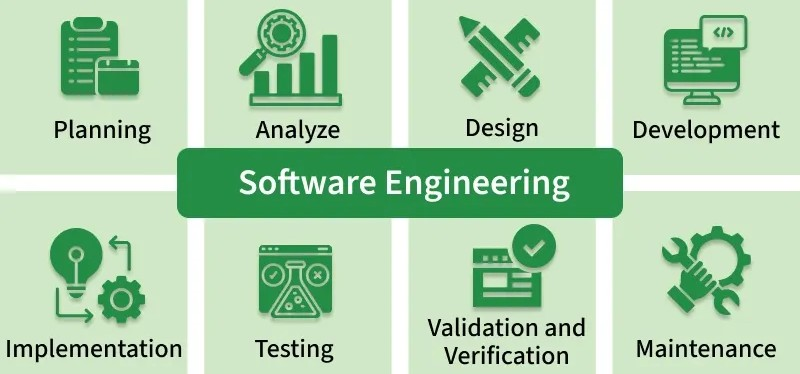

I think one of the best ways to understand someone is to understand what they do and why. I've heard many different times of people butting heads in teams with various backgrounds simply because one or both sides has a fundamental misunderstanding of the other. One of the first examples that comes to mind is when my mom would often tell me that teachers like herself would have their work hampered by school administrators that had never been a classroom teacher. They would impose extra paperwork or rules that would be nonsensical to anyone who has been teaching in the classroom recently. Although I don't plan on becoming a teacher or an administrator, these stories from my mom have shown me the importance of understanding the different people on your team to work with them effectively. This mindset is one of the main reasons I am interested in learning software engineering. 

## What is Software Engineering?

<small>Image from [geeksforgeeks.com](https://www.geeksforgeeks.org/software-engineering/software-engineering/).</small>

Before I talk more about my motivation for learning software engineering, let's briefly discuss what software engineering is. According to Michigan Technological University, software engineering is *"the branch of computer science that deals with the design, development, testing, and maintenance of software applications."* Software engineers therefore have to combine engineering principles of design and their knowledge of computer programming to make applications that are reliable, secure, and easily scalable to solve problems posed by their clients or end users. 

## Software Engineering as a Computer Engineer

While I am not planning on becoming a software engineer in the near future, I do hope to go into the cybersecurity field. As cybersecurity has to secure everything from the electrical hardware all the way up to software applications, I will need to be able to work and communicate with many different types of people. Software engineers will be one of these types of people as new applications, whether it be a cybersecurity tool or a corporate application, need to have appropriate cybersecurity controls baked into its code. I believe learning and experiencing a little bit of what a software engineer does and the way they have to think about applications is one of the best ways to understand a software engineer's perspective.

