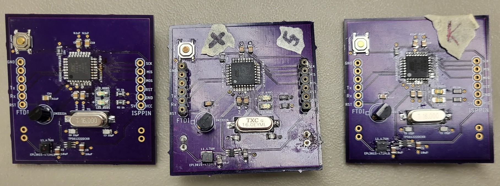

<small>Three Bumblebee PCBs. My partially soldered board is on the right, the completed reference board is in the center, and another teammate's board is on the right.</small>

Smart Campus Energy Lab (SCEL) is a Vertically Integrated Project (VIP) in the College of Engineering at UH Manoa. The goal of SCEL is to make low-cost weatherboxes to capture weather data across the UH Manoa campus to then be used to inform and predict energy production and usage on campus. This supports the UH System's goal of being net-zero in energy use by 2035.

As a part of Team Bumblebee, the communication module team, I helped test the range of the XBees, our communication device, across Dole Street, East-West Road, and between campus buildings to determine the maximum distance apart that the XBees can communicate. Additionally, I populated a printed circuit board (PCB) of a simplified version of the full weatherbox to enable testing of the XBees in the weatherbox's housing.

You can learn more about SCEL [here](https://scel-hawaii.org/).
