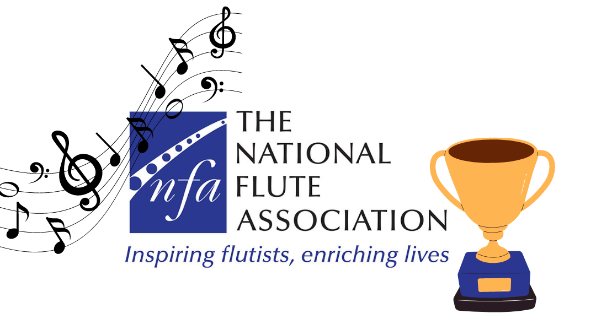

Adapted from [flutes.com](https://www.flutes.com/five-outstanding-winners-of-the-nfa-newly-published-music-prize-2024).\

The 2026 National Flute Association (NFA) Young Artist Competition was a national flute competition for flutists under 30 years old to compete for an $8000 prize and a feature in *The Flutist Quarterly*, a national flute magazine. The first round of this competition was a recorded round where flutists submitted recordings of themselves playing two pieces with piano and one piece alone to become one of 15 quarterfinalists to play in the quarterfinal at the 2026 NFA convention in Portland, Oregon in August 2026. 

The pieces for the recorded round came out in August 2025 and I decided to prepare the pieces to enter into the competition. This started an over six month long process of practicing these pieces and eventually rehearsing and recording with a pianist. I submitted my recordings in February 2026 and unfortunately did not advance to the quarterfinal. While this result was disappointing, it was a very valuable experience for strengthening my focus and dedication skills as well as my flute playing. Preparing for this competition helped me grow in many ways, both musically and otherwise, and it was a great motivator to be consistent and intentional when playing the flute.   

You can learn more about the National Flute Association [here](https://www.nfaonline.org/home).
